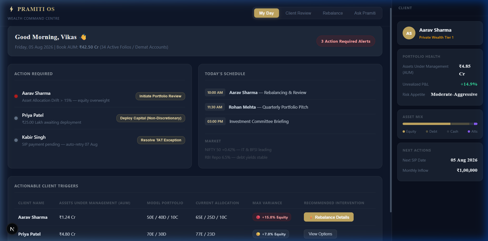
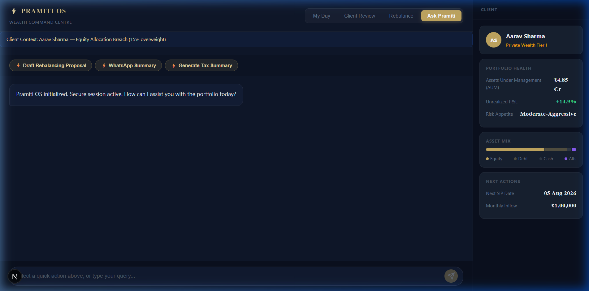
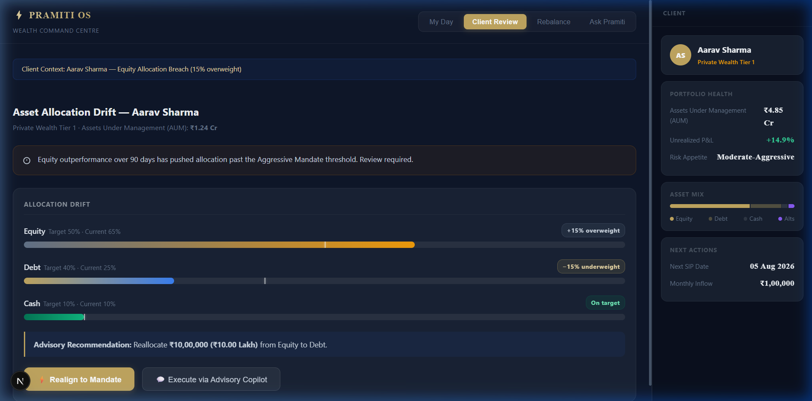
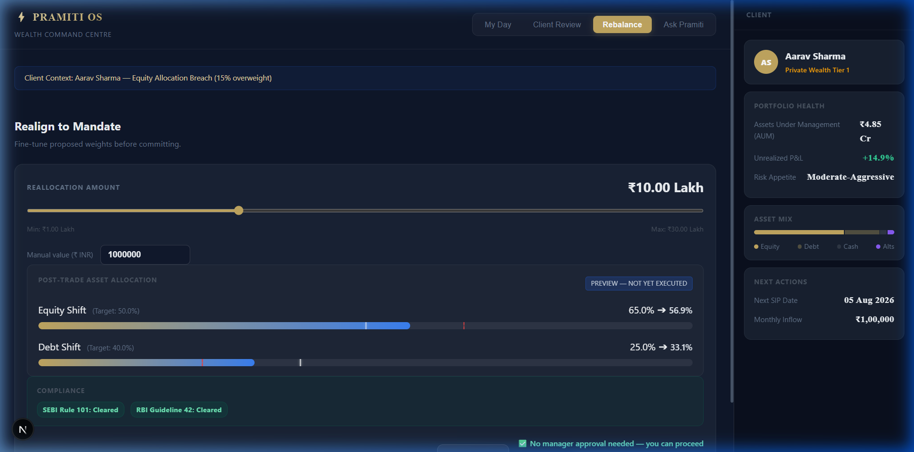

# Pramiti OS

> **प्रमिति (Pramiti)** — Sanskrit: *valid, justified knowledge* — the accurate, well-founded understanding that results when a reliable means of knowing is applied to a real object, as distinct from guesswork, bias, or false impression.
> 
> **Why the name fits:** Pramiti OS exists to give Relationship Managers one accurate, verified view of a client's portfolio — synthesized from fragmented systems into a single trustworthy source of truth, with every material action confirmed by human judgment before it takes effect. The name reflects the outcome the product is meant to deliver: validated knowledge, not a generative guess.

> **A multi-agent architecture PoC demonstrating stateful LLM orchestration for financial workflows.**  
> Built to evaluate the feasibility of unifying fragmented banking tools while enforcing DPDP privacy rules and RBI human-in-the-loop guidelines via programmatic graph interrupts.

---

<b>📸 View Pramiti OS Interface Screenshots</b>

### My Day Dashboard

### Ask Pramiti Chat Copilot

### Client Review

### Rebalance

---

## 1. Project Motivation

Relationship Managers (RMs) in wealth management often operate across multiple disconnected systems (CRM, Core Banking, market terminals). This fragmentation requires manual data aggregation during client calls, increasing the risk of error and reducing advisory time.

Simultaneously, standard LLM wrappers pose significant regulatory challenges in this domain:
1. **DPDP Act (Privacy)**: Passing raw PII to generalized models violates data minimization and purpose limitation rules.
2. **RBI MRMF (Model Risk)**: Autonomous algorithmic execution in high-risk financial scenarios without human oversight is prohibited.

This PoC explores how an agentic architecture (LangGraph + MCP) can securely bridge internal APIs while enforcing compliance guardrails.

> **For how this PoC scales to production as a layer on existing bank infrastructure, see the [Scale and Integration Strategy](docs/04-design-and-architecture/Scale-and-Integration-Strategy.md) document.**

---

## 2. Technical Approach & Architecture

Pramiti OS utilizes a decoupled architecture to separate reasoning (LLM), integration (MCP), and orchestration (LangGraph).

* **Orchestration**: `LangGraph` is used to define stateful, cyclic workflows. Instead of linear chains, it allows for branching logic and explicit interrupt nodes.
* **Integrations**: `Model Context Protocol (MCP)` is implemented as a middleware layer. Instead of the LLM calling APIs directly, MCP servers expose specific database queries (Supabase) or document retrieval (Qdrant) and handle PII masking before returning context to the model.
* **LLMs**: Designed for local execution using open-weight models (`Sarvam-30B` for routing, `Sarvam-105B` for reasoning). 
  * **PoC vs. Production Trade-off**: The current MVP utilizes the **Groq API (`llama-3.3-70b-versatile`)** to simulate these models. *Why?* Cloud APIs provide ultra-low latency and bypass local GPU hardware constraints, allowing us to rapidly prove the architectural flow (Vertical Slice). However, passing financial data to a cloud endpoint violates DPDP data localization laws. Therefore, the **Production deployment** strictly mandates transitioning to an on-premise, air-gapped VPC cluster running Sovereign Open-Weights (Sarvam/Llama) to ensure 100% data privacy and compliance.

### Compliance Implementation
* **Human-in-the-Loop**: High-risk state changes (e.g., generating a portfolio reallocation proposal) trigger a `NodeInterrupt` in LangGraph, pausing execution until explicit user validation is received.
* **Data Masking**: The MCP middleware strips PII (PAN, Mobile, Name) before payload transmission.

---

## 3. Known Limitations & Trade-offs (MVP)

* **Hardware Constraints**: Running 30B/105B MoE models locally requires significant VRAM (A100/H100 clusters). This PoC currently abstracts this by pointing to cloud inference APIs. 
* **Latency**: The multi-agent routing and MCP tool execution introduces latency overhead compared to direct API calls.
* **Scope**: This is a proof-of-concept demonstrating architectural patterns for compliance, not a production-ready application. Error handling and distributed tracing are currently minimal.

---

## 4. Documentation Index

Detailed specifications, research, and technical designs are maintained in the `/docs` directory:

* [**Scale and Integration Strategy**](docs/04-design-and-architecture/Scale-and-Integration-Strategy.md) — **⭐ Canonical reference for PoC-to-production scaling.** Explains how Pramiti OS integrates with CBS, CRM, and internal systems as an additive layer (not a replacement), the current build-vs-target architecture reconciliation, and the phased production rollout plan. Read this before any integration or production-scaling work.
* [System Architecture & Technical Design](docs/04-design-and-architecture/System%20Architecture%20&%20Technical%20Design.md)
* [Developer Setup & Troubleshooting Guide](docs/04-design-and-architecture/Developer%20Setup%20and%20Troubleshooting.md)
* [Pramiti OS Core PRD](docs/03-prds-and-specs/Pramiti%20OS%20PRD.md)
* [Product Strategy & Roadmap](docs/01-strategy-and-vision/Product%20Strategy%20and%20Vision.md)
* [User Personas & JTBD Research](docs/02-research-and-discovery/User%20Personas%20and%20JTBD.md)
