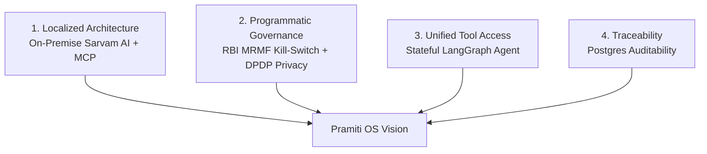

# Product Strategy & Vision: Pramiti OS

**Document Owner**: Product Management / Executive Strategy  
**Target Audience**: Executive Leadership, Bank IT Steering Committees, Investors  
**Horizon**: 2026–2028  

---

## 1. Product Vision Statement

> **"To build a localized, multi-agent platform for Indian BFSI that reduces manual data aggregation for Relationship Managers and enforces DPDP and RBI compliance through programmatic graph interrupts."**

---

## 2. Strategic Pillars

1. **Localized Architecture**: Utilizing open-weights Sarvam AI models (Sarvam-30B & Sarvam-105B) for low-latency reasoning within a restricted cloud boundary to satisfy localization requirements.
2. **Programmatic Regulatory Governance**: Embedding RBI MRMF interrupt nodes, SEBI CSCRF vulnerability monitoring, and DPDP Act data minimization directly into the LangGraph execution flow.
3. **Unified Tool Access**: Connecting legacy internal systems (CBS, CRM, FNZ, Bloomberg terminals) via Model Context Protocol (MCP) servers to reduce manual data synthesis for RMs.
4. **Traceability**: Writing execution history via PostgresSaver to provide audit logs for internal and regulatory inspections.

---

## 3. Value Proposition Canvas

### Customer Profile (Bank Management & RMs)
* **Jobs**: Scale Assets Under Management (AUM), mobilize monthly SIPs, cross-sell wealth & credit products, maintain regulatory compliance.
* **Pains**: High RM attrition due to administrative burnout, 15–20% digital drop-off during onboarding, threat of RBI/SEBI regulatory penalties for non-compliant AI.
* **Gains**: 3x AUM capacity per RM, 80% reduction in post-call logging time, zero compliance breaches.

### Value Map (Pramiti OS)
* **Products & Services**: Multi-agent AI Operating System, LangGraph Orchestrator, MCP Banking Connectors, RBI Kill-Switch Portal.
* **Pain Relievers**: Automated call transcription & proposal drafting, instant market-shock portfolio synthesis, automated PII scrubbing.
* **Gain Creators**: Real-time cross-sell recommendation engine, < 2-second quote generation, 10-year immutable audit log retention.

## 4. Lean Canvas (Business Model Snapshot)

To ensure strategic alignment, we map the product using the **Lean Canvas Framework**:

* **Problem**: RM workflow fragmentation, DPDP vs RBI regulatory requirements, digital application drop-offs.
* **Customer Segments**: B2B Tier-1 Banks (Buyers: CIO/CRO, Users: Wealth RMs).
* **Unique Value Proposition (UVP)**: A locally-hosted LLM orchestration platform that implements strict RBI MRMF interrupt nodes and stateless PII scrubbing.
* **Solution**: Agentic AI Mesh (LangGraph + MCP + Sarvam AI).
* **Channels**: Direct B2B Enterprise Sales, Systems Integrator Partnerships (TCS, Infosys).
* **Revenue Streams**: SaaS Licensing (per RM seat), Dedicated VPC Hosting Fees, Implementation Fees.
* **Cost Structure**: On-Premise GPU Compute (vLLM), R&D (Agent graph development), Compliance Auditing.
* **Key Metrics**: AUM Mobilization Velocity, DPDP Masking Success Rate.
* **Unfair Advantage**: Deep architectural coupling with upcoming (2026) Indian regulatory mandates.

---

## 5. OKRs (Objectives & Key Results) — FY 2026-2027

### Objective 1: Prove RM Productivity & Workflow Augmentation
* **KR 1.1**: Reduce RM post-consultation administrative logging time from 25 minutes to < 60 seconds.
* **KR 1.2**: Increase average monthly SIP mobilization velocity by 35% across pilot RM cohorts.
* **KR 1.3**: Achieve an RM Net Promoter Score (NPS) of > 65 within 90 days of pilot deployment.

### Objective 2: Enforce 100% Programmatic Regulatory Compliance
* **KR 2.1**: Achieve 0% PII leaks or DPDP Act consent violations via MCP middleware scrubbing.
* **KR 2.2**: Demonstrate 100% execution pause compliance on high-risk actions via `interrupt_before=["human_review"]`.
* **KR 2.3**: Pass 100% of RBI MRMF Third-Party Model Risk Audits across deployment tiers.

### Objective 3: Scale Enterprise Adoption & Infrastructure Reliability
* **KR 3.1**: Onboard 50 RMs across 2 Tier-1 Indian Banks in Phase 1 Pilot.
* **KR 3.2**: Maintain p99 latency < 2.5 seconds for Sarvam-30B graph routing queries.
* **KR 3.3**: Maintain 99.95% system uptime across PostgresSaver checkpointer and MCP servers.
