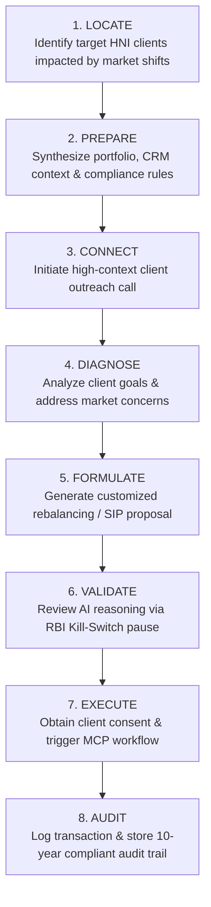

# User Personas & Jobs-To-Be-Done (JTBD) Framework: Pramiti OS

**Document Owner**: Product Management  
**Target Domain**: Indian BFSI Wealth Management & Retail Banking  
**Framework**: Outcome-Driven Innovation (ODI) & Christensen JTBD Framework  

---

## 1. Primary User Personas

### 👤 Persona 1: The Wealth Relationship Manager (RM)
* **Archetype**: Front-line Sales & Advisory Practitioner
* **Certifications**: NISM Series V-A (Mutual Funds), IRDAI (Insurance)
* **Operational Profile**:
  * **AUM Managed**: ₹150+ Cr across 100–150 High-Net-Worth Individual (HNI) clients.
  * **Daily Velocity**: 80–100 outbound client touches, 5–8 deep portfolio consultations.
  * **Current Tool Stack**: Core Banking System (CBS), Legacy CRM (Salesforce/CRMnext), FNZ Wealth Platform, Market Data Terminals (Bloomberg/Moneycontrol), Internal Compliance Portals.
* **Core Pain Points**:
  * **The Toggling Tax**: Forces manual context-switching across 5–7 disconnected software applications during live client conversations.
  * **Synthesis Bottleneck**: Unable to instantly calculate real-time portfolio impacts of market dips during live calls, forcing deferred "I'll get back to you" responses.
  * **Post-Call Paralysis**: Spends 3+ hours daily on manual CRM updates, compliance logging, and drafting investment proposals.

---

### 👤 Persona 2: The High-Net-Worth Client (HNI Client)
* **Archetype**: Busy Business Owner / Senior Executive
* **Financial Footprint**: ₹1 Cr+ investable surplus across Equity, Mutual Funds, SIPs, and Structured Debt.
* **Expectations**: Hyper-personalized, real-time financial advisory with zero administrative friction.
* **Core Pain Points**:
  * **Generic Chatbot Frustration**: Frustrated by stateless B2C banking chatbots offering generic FAQ responses during complex onboarding or portfolio queries.
  * **Drop-Off Friction**: Experiencing 3–5 day delays for KYC verification and customized loan term sheets.
  * **Privacy Concerns**: Demands full data privacy under DPDP Act 2023; refuses unbundled data sharing without clear consent control.

---

### 👤 Persona 3: Chief Risk & Compliance Officer (CRO)
* **Archetype**: Institutional Risk Guardian
* **Regulatory Accountability**: Direct oversight of RBI MRMF, SEBI CSCRF, and DPDP Act compliance.
* **Core Pain Points**:
  * **Shadow AI Exposure**: RMs using unauthorized consumer AI tools (ChatGPT/Claude) with unmasked client PII.
  * **Algorithmic Hallucination Risk**: Unconstrained AI generating non-compliant financial advice.
  * **Audit Deficit**: Lack of 10-year immutable audit trails for AI-driven recommendations.

---

## 2. Jobs-To-Be-Done (JTBD) Statements

### 🎯 Main Core Job (The Relationship Manager)
> **"When** market volatility occurs during an HNI client consultation,  
> **I want to** instantly synthesize the client's multi-product portfolio against real-time market data and regulatory rules,  
> **So that** I can deliver tailored, compliant investment proposals on the call without losing conversational momentum or incurring administrative overhead."

---

### 🛠️ Functional Jobs

| Job ID | Trigger / Situation | Job Statement | Desired Outcome / Metric |
| :--- | :--- | :--- | :--- |
| **FJ-01** | Client calls asking about portfolio dip during market shock. | Cross-reference live market data with client asset allocations in real time. | Reduce data retrieval time from 8 minutes to < 2 seconds. |
| **FJ-02** | Client agrees to top-up SIP or rebalance portfolio. | Calculate tax-adjusted SIP returns and rebalancing allocations automatically. | 100% mathematical accuracy with 0 manual spreadsheet calculations. |
| **FJ-03** | Consultation call concludes. | Transcribe call summary, update CRM fields, and trigger follow-up proposals. | Reduce post-call logging time from 25 mins to < 60 seconds. |
| **FJ-04** | Draft proposal contains credit/wealth product recommendations. | Verify proposal against SEBI compliance guidelines and RBI MRMF rules. | 0% regulatory compliance violations across all client outputs. |

---

### ❤️ Emotional Jobs (Internal State)

* **Confidence & Authority**: Feel fully prepared and authoritative when handling high-stakes HNI questions without pausing or deferring.
* **Regulatory Protection**: Feel secure knowing that every AI-generated suggestion is pre-audited and protected by programmatic guardrails.
* **Reduced Burnout**: Feel relieved of tedious, repetitive administrative data entry at the end of the workday.

---

### 🌐 Social Jobs (External Perception)

* **Trusted Advisor Status**: Be perceived by clients as a proactive, top-tier wealth strategist rather than a transactional salesperson.
* **Institutional Recognition**: Be recognized internally as a top-quartile RM driving high AUM mobilization.

---

## 3. The 8-Step Job Map (Relationship Manager Advisory Lifecycle)

---

## 4. Outcome-Driven Innovation (ODI) Opportunity Matrix

| Step | User Need / Desired Outcome | Importance (1-10) | Satisfaction (1-10) | Opportunity Score | Pramiti OS Solution Feature |
| :--- | :--- | :--- | :--- | :--- | :--- |
| **Locate** | Minimize time spent scanning multiple apps for impacted clients. | 8.5 | 3.2 | **13.8 (High)** | Proactive Portfolio Alert Engine |
| **Prepare** | Eliminate manual cross-referencing of CBS, FNZ, and market terminals. | 9.2 | 2.1 | **16.3 (Critical)** | Multi-Agent Portfolio Synthesizer |
| **Formulate** | Generate tax-efficient, customized SIP/wealth proposals instantly. | 9.0 | 3.0 | **15.0 (Critical)** | Sarvam-105B Reasoning Agent |
| **Validate** | Ensure 100% compliance without slowing down advisory execution. | 9.5 | 4.0 | **15.0 (Critical)** | LangGraph RBI Kill-Switch Interrupt |
| **Audit** | Automate CRM updates and regulatory compliance logging. | 8.8 | 2.5 | **15.1 (Critical)** | MCP Automated Audit Logger |

---

## 5. Integration into Pramiti OS Architecture

Also updated in [`Pramiti OS PRD.md`](https://github.com/VIKAS9793/pramiti-os/blob/main/docs/03-prds-and-specs/Pramiti%20OS%20PRD.md):
- **Portfolio Agent**: Directly serves **FJ-01** and **FJ-02**.
- **Research & Compliance Agent**: Directly serves **FJ-04**.
- **RBI MRMF Kill-Switch**: Directly serves **Emotional & Social Jobs (Regulatory Protection & Trust)**.
