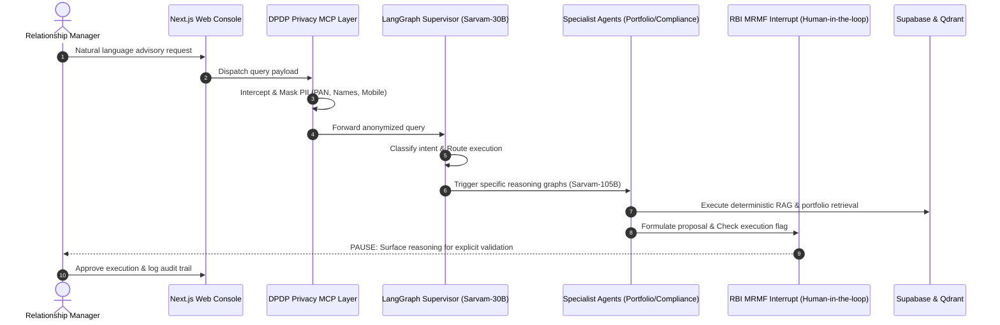

# Developer Setup & Troubleshooting Guide

**Product**: Pramiti OS  
**Target Audience**: Software Engineers, DevOps, Security Auditors  

---

## 1. System Architecture



## 2. Core Engineering Guardrails

Pramiti OS is architected ground-up around three non-negotiable compliance pillars:

1.  **Data Sovereignty (100% Localization)**: Utilizes open-weights Sarvam AI models (`Sarvam-30B` for low-latency routing, `Sarvam-105B` for complex reasoning) deployed locally within an India-based VPC. No data crosses international borders.
2.  **RBI MRMF Kill-Switches**: Implements LangGraph `NodeInterrupt` patterns. The system is structurally incapable of executing high-risk financial actions (e.g., portfolio reallocation, emailing clients) without explicit, logged human authorization.
3.  **DPDP Data Masking**: External tool integrations are tightly coupled through the Model Context Protocol (MCP). MCP middleware acts as a cryptographic boundary, stripping and tokenizing PII before it ever reaches the LLM context window.

---

## 3. Quick Start / Installation

### Prerequisites
* Python 3.11+
* Node.js 18+
* Docker Desktop (for local Supabase and Qdrant instances)
* `uv` package manager

### Step 1: Clone and Configure
```bash
git clone https://github.com/your-org/pramiti-os.git
cd pramiti-os
cp .env.example .env
```

### Step 2: Initialize Infrastructure
```bash
# Start local Supabase (PostgreSQL) and Qdrant (Vector DB) containers
docker-compose up -d

# Run database migrations
make db-migrate
```

### Step 3: Start the MCP Servers
```bash
cd backend/mcp_servers
uv venv
source .venv/bin/activate
uv pip install -r requirements.txt

# Start the secure MCP middleware layer
python -m mcp_server.main --port 8000
```

### Step 4: Run the LangGraph Orchestrator
```bash
cd ../orchestrator
uv pip install -r requirements.txt

# Start the agentic state graph backend
python -m uvicorn graph.main:app --reload --port 8001
```

### Step 5: Launch the Frontend
```bash
cd ../../frontend
npm install
npm run dev
```
The console will be available at `http://localhost:3000`.

---

## 4. Troubleshooting Common Issues

* **OOM (Out of Memory) on Model Load**: If local vLLM crashes loading Sarvam-105B, ensure you have multiple A100 GPUs or switch to the Sarvam Cloud API by setting `USE_SARVAM_CLOUD=true` in your `.env`.
* **MCP Connection Refused**: Ensure the MCP server is running on port 8000 before starting the LangGraph orchestrator on port 8001.
* **Missing PostgreSQL Checkpoints**: If LangGraph state is failing to persist, verify that Supabase is running (`docker ps`) and the `POSTGRES_URI` is correctly mapped.
