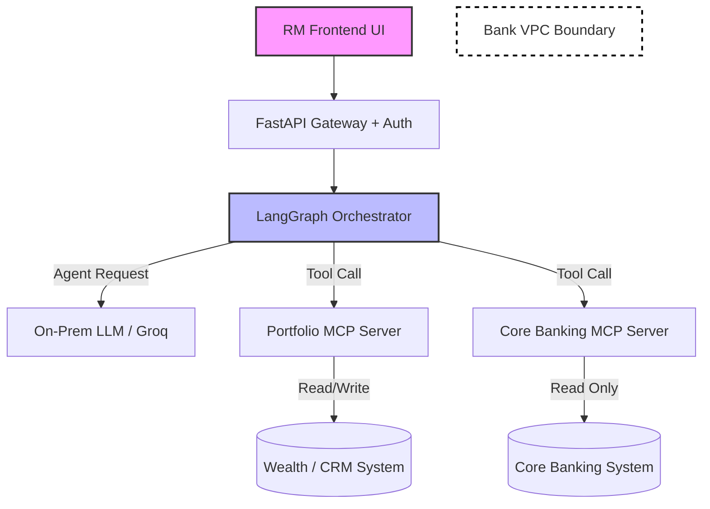

# Scale and Integration Strategy: Pramiti OS
**Date:** 2026-07-25
**Document Owner:** Product Management & Lead Architect
**Audience:** CIO, CTO, Head of Wealth Operations, Board Risk Committee
**Status:** Revised — supersedes prior version. This revision reconciles the target architecture against the current, verified state of the source code, and adds the phased PoC-to-production plan requested by leadership.

> **📌 REFERENCE NOTE: This is the canonical document for how Pramiti OS scales from PoC to production as a layer on top of existing Core Banking, CRM, and internal systems. Any team member, engineer, AI coding/design tool, or reviewer looking to understand the integration architecture, current build status, or the phased production rollout plan should treat this document as the single source of truth and reference it directly — do not re-derive or assume this architecture from the README, PRD, or other docs, as those may not reflect the reconciliation and phased plan captured here.**

---

## 1. Executive Summary: Additive Layer vs. System Replacement

The single most critical question for scaling Pramiti OS is whether it is intended to replace an existing CRM/Wealth Management platform or sit alongside it.

**Stated Position: Pramiti OS is an Additive Synthesis Layer.**
Pramiti OS is **not** designed to replace Salesforce, FNZ, or the Core Banking System (CBS). It is an orchestration and synthesis layer that sits *on top* of existing infrastructure. It federates data via read-only APIs, performs compliance checks, and routes approved actions back to the underlying systems of record.

This position significantly de-risks adoption:
- **Zero Data Migration** — no client portfolios need to be migrated; systems of record stay exactly where they are.
- **Lower Change Management** — RMs continue using their CRM for standard data entry; Pramiti OS is invoked for complex, multi-system queries and compliant execution support.
- **Graceful Degradation** — if Pramiti OS goes down, the underlying systems (CRM, CBS) remain fully operational.

This position is unchanged from the original strategy. What changes in this revision is an honest account of **what is currently built versus what is target architecture**, and a phased plan to close that gap responsibly before wider production scaling.

---

## 2. Integration Architecture via MCP (Model Context Protocol)

To federate data without building custom, brittle point-to-point integrations, Pramiti OS uses the **Model Context Protocol (MCP)** as its connector standard.

### Network Topology and Security Boundary
Pramiti OS operates *inside* the bank's existing VPC.

1. **User Request:** The RM submits a query via the Pramiti UI.
2. **LangGraph Orchestrator:** The `supervisor_node` routes to the appropriate specialist agent.
3. **MCP Servers (The Connectors):**
   - `portfolio_server` — target: FNZ Wealth / internal portfolio databases via REST.
   - `cbs_server` — target: legacy Core Banking System (Finacle / BaNCS) via an internal API gateway.
   - `sip_server` — local calculator, no external dependency.
4. **Data Masking (DPDP):** The MCP server is designed to fetch raw data, apply DPDP masking, and pass only masked identifiers into the LLM context window.
5. **Execution:** Actions are proposed, validated by the Compliance node, and interrupted for RM approval. On approval, the orchestration layer executes the write-back via the relevant MCP server.

### Current Build State vs. Target Architecture — Reconciliation

This revision adds the section the prior version did not have: an explicit, verified statement of what exists in code today versus what is target state for production scaling. This distinction must be visible to any Risk Committee reviewing this document.

| Architecture Element | Target State (this document) | Current PoC Build State (verified against source) |
|---|---|---|
| `portfolio_server` MCP integration | Live REST connection to FNZ/wealth platform | **Not yet built** — currently reads a static local mock JSON file, no real system connection |
| `cbs_server` MCP integration | Read-only connection to Finacle/BaNCS via internal API gateway | **Not yet built** — no core banking MCP server exists in the current codebase |
| DPDP masking at MCP layer | Raw data masked before reaching LLM context | **Present in code but not functioning** — the masking function targets a field name that does not match the current data schema, so client names currently reach the LLM unmasked. This is the top-priority fix before any real CBS/CRM data is connected. |
| JWT-signed RM approval | Every resume-from-interrupt action cryptographically attributed to an authenticated RM | **Not yet built** — no authentication/authorization layer exists in the current API |
| Postgres-backed audit trail (`rbi_mrmf_audit_logs`) | Persistent, 10-year-retained record of every approval decision | **Not yet built** — current state persistence is in-memory only and does not survive a process restart |
| Human-in-the-loop interrupt (graph-level, non-bypassable) | Enforced structurally, not a dismissible UI element | **Built and functioning as designed** — this control works correctly today |
| Kill switch | Instant deactivation via environment-level control | **Built and functioning as designed** — verified working, including graceful degradation |
| Structured, RAG-grounded compliance verdicts | Deterministic, citation-backed, non-hallucinated | **Built and functioning as designed** — this is genuinely production-quality today |

**Why this table matters:** three of the four elements this strategy depends on for its DPDP and RBI MRMF compliance claims are not yet functioning, while the two hardest architectural problems (the interrupt pattern and the kill switch) already are. This is the accurate basis for sequencing Section 4 below — closing the compliance-control gaps comes before adding real CBS/CRM data, not after.

---

## 3. Indicative OpEx Model (Oversight vs. Replacement)

When pitching to the CFO/CIO, the cost of running Pramiti OS must be compared against realistic alternatives.

**Scenario A: Running Pramiti OS as a Thin Layer (Recommended Path)**
- **Compute:** Scalable FastAPI + LangGraph containers (EKS/GKE). Minimal persistent storage overhead once Postgres-backed audit logging is implemented (see Phase 1, Section 4).
- **Inference Cost:** Token-based pricing for LLM API usage during PoC/pilot; amortized GPU cost for sovereign on-prem models at production scale, per the data-localization requirement already documented in the project README.
- **Integration Maintenance:** Estimated 1-2 FTEs to build and then maintain MCP server schemas as underlying CBS/CRM APIs evolve — this is an ongoing cost, not a one-time build cost, and should be budgeted as such from Phase 1 onward.
- **Estimated OpEx:** Scales with usage and number of connected systems; no major fixed CapEx beyond the initial GPU cluster if deploying on-prem, and no CBS/CRM database duplication.

**Scenario B: Building a Standalone "All-in-One" Platform (Not Recommended)**
- **Compute & Storage:** Duplication of portfolio and core banking data stores.
- **Development Cost:** Extended timeline to rebuild CRM and transactional UI functionality that already exists in the bank's current stack.
- **Integration Maintenance:** Continuous bi-directional sync (ETL) between legacy systems and the new platform, introducing data consistency risk that the thin-layer approach avoids entirely.
- **Estimated OpEx:** Materially higher — sunk build cost plus ongoing sync maintenance, with no corresponding reduction in the bank's existing system footprint.

**Conclusion:** The MCP-based thin orchestration layer remains the correct path — it minimizes both integration time and ongoing operational expenditure by treating existing systems as the source of truth. This conclusion is unchanged from the original strategy; what changes is the sequencing below.

---

## 4. Phased PoC-to-Production Scaling Plan

This is the section requested by leadership: an explicit plan for how Pramiti OS scales from its current PoC state to a production layer sitting on top of existing CBS, CRM, and internal systems — sequenced to close the compliance-control gaps in Section 2 before real customer data is connected.

### Phase 1 — Close the Compliance-Control Gap (No new integrations in this phase)
- [ ] Fix DPDP masking to operate correctly against the current production data schema; verify with an automated test that every sensitive field is actually transformed, not just that the function runs without error.
- [ ] Implement authentication/authorization on every API endpoint, and JWT-signed attribution on every approval action, as originally specified.
- [ ] Implement Postgres-backed persistence for the LangGraph checkpointer and stand up the `rbi_mrmf_audit_logs` table, replacing the current in-memory state.
- [ ] **Gate:** No real CBS, CRM, or client data flows through the system until all three items above are verified working in a staging environment. This is a hard gate, not a parallel workstream.

### Phase 2 — First Real Integration (Read-Only)
- [ ] Build `portfolio_server` as a live, read-only connection to the FNZ/wealth platform, replacing the current mock JSON data source.
- [ ] Validate data accuracy, latency, and masking behavior against real (or realistic anonymized) data in staging before any RM sees it.
- [ ] Exit criteria: zero unplanned write attempts logged, masking verified on every field via automated test, latency acceptable for live client-call use.

### Phase 3 — Core Banking Integration (Read-Only)
- [ ] Build `cbs_server` as a read-only connection to Finacle/BaNCS via the bank's existing internal API gateway — explicitly avoiding any new public-facing exposure of the core banking system.
- [ ] This is where the original "reduce RM toggling across systems" business case becomes measurable — instrument and report actual time-saved data from this phase onward.
- [ ] Each new integration reuses the security-approved MCP pattern established in Phase 2, rather than requiring a fresh security review from first principles.

### Phase 4 — Gated Write Capability
- [ ] Introduce write-back capability (e.g., an actual rebalancing instruction reaching CBS) only after Phases 1-3 have run stably in production for a defined observation period.
- [ ] Write-capable integration requires its own dedicated Board Risk Committee sign-off, separate from the read-only integration approvals in Phases 2-3 — this is a materially different risk category under both RBI and SEBI frameworks.

### Phase 5 — Scale Across RM Base
- [ ] Expand from pilot RM group to full book only after Phase 4's write capability (if included in scope) has demonstrated clean audit logs and zero authentication or masking incidents over the observation window.
- [ ] Reassess the OpEx model in Section 3 against actual measured integration-maintenance cost at this point, not the estimated figures — this is when Finance should get a real number instead of a projection.

---

## 5. Guiding Principle for This Strategy

> **This document commits to a specific target architecture. Every future revision must state plainly what is built versus what is still target state — the moment that distinction blurs, this stops being a strategy document and becomes a liability if presented to a regulator as current fact.**

---

*This document supersedes the prior version of "Scale-and-Integration-Strategy.md." The positioning (additive layer, MCP-based integration, thin-layer OpEx model) is retained and reaffirmed; Sections 2's reconciliation table and Section 4's phased plan are new, added to ensure this document reflects verified code state and gives leadership an accurate, actionable path to production.*
