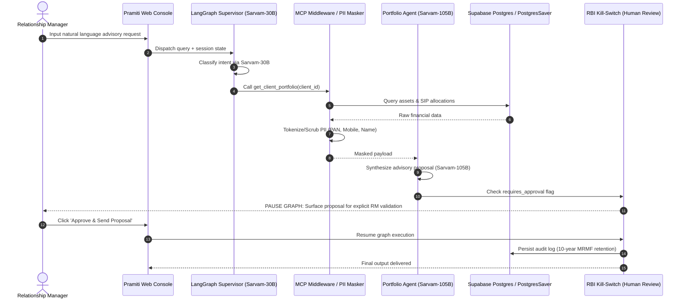

# System Architecture & Technical Design Specification: Pramiti OS

**Document Owner**: Lead Systems Architect & Principal Engineer  
**Target Audience**: Engineering Teams, Security Architects, DevOps, Bank IT Auditors  
**System Version**: 1.0-MVP  

---

## 1. High-Level Architecture Diagram



---

## 2. Component Specifications

### 2.1 Model Context Protocol (MCP) Server Contracts

Pramiti OS implements standard JSON-RPC 2.0 MCP servers to decouple the LLM graph from core banking ledgers.

#### MCP Server 1: `wealth-data-server`

```python
# MCP Tool Definition: get_client_portfolio
{
  "name": "get_client_portfolio",
  "description": "Retrieves asset allocation, SIP performance, and product holdings for a client.",
  "parameters": {
    "type": "object",
    "properties": {
      "client_id": {
        "type": "string",
        "description": "Anonymized internal client UUID."
      }
    },
    "required": ["client_id"]
  }
}
```

```python
# MCP Tool Definition: calculate_sip_return
{
  "name": "calculate_sip_return",
  "description": "Calculates projected SIP returns and tax implications for mutual fund rebalancing.",
  "parameters": {
    "type": "object",
    "properties": {
      "monthly_amount": {"type": "number"},
      "duration_months": {"type": "integer"},
      "expected_return_pct": {"type": "number"}
    },
    "required": ["monthly_amount", "duration_months", "expected_return_pct"]
  }
}
```

---

### 2.2 Database DDL Schema (Supabase PostgreSQL)

```sql
-- 1. Clients Table (PII Encrypted at Rest)
CREATE TABLE clients (
    client_id UUID PRIMARY KEY DEFAULT gen_random_uuid(),
    anonymized_token VARCHAR(64) UNIQUE NOT NULL,
    risk_profile VARCHAR(20) CHECK (risk_profile IN ('Conservative', 'Moderate', 'Aggressive')),
    total_aum_inr NUMERIC(15, 2) NOT NULL,
    created_at TIMESTAMP WITH TIME ZONE DEFAULT NOW()
);

-- 2. Portfolios Table
CREATE TABLE portfolios (
    portfolio_id UUID PRIMARY KEY DEFAULT gen_random_uuid(),
    client_id UUID REFERENCES clients(client_id),
    asset_class VARCHAR(50) NOT NULL, -- Mutual Funds, Direct Equity, Fixed Income
    scheme_name VARCHAR(150) NOT NULL,
    current_value_inr NUMERIC(15, 2) NOT NULL,
    monthly_sip_inr NUMERIC(12, 2) DEFAULT 0.00,
    updated_at TIMESTAMP WITH TIME ZONE DEFAULT NOW()
);

-- 3. RBI MRMF 10-Year Audit Log Table
CREATE TABLE rbi_mrmf_audit_logs (
    log_id UUID PRIMARY KEY DEFAULT gen_random_uuid(),
    session_id VARCHAR(100) NOT NULL,
    rm_id VARCHAR(100) NOT NULL,
    agent_name VARCHAR(50) NOT NULL,
    prompt_tokens INT NOT NULL,
    completion_tokens INT NOT NULL,
    proposal_summary TEXT NOT NULL,
    human_action VARCHAR(20) CHECK (human_action IN ('APPROVED', 'REJECTED', 'MODIFIED')),
    timestamp TIMESTAMP WITH TIME ZONE DEFAULT NOW()
);

-- Indexing for high-velocity query performance
CREATE INDEX idx_portfolios_client ON portfolios(client_id);
CREATE INDEX idx_audit_timestamp ON rbi_mrmf_audit_logs(timestamp);
```

---

## 3. Data Privacy & PII Tokenization Pipeline

To comply with Section 6(1) of the **DPDP Act 2023**, client data undergoes real-time tokenization prior to context window ingestion:

```
[Raw CBS/CRM Record] 
   └── Name: "Rajesh Sharma", PAN: "ABCDE1234F", Mobile: "+919876543210"
         │
         ▼  (MCP Scrubbing Middleware)
[Tokenized Payload]
   └── Client_ID: "USR-77492-X", Risk_Tier: "Moderate", Portfolio: "INR 2.4 Cr"
         │
         ▼  (Graph Payload Ingestion)
[Sarvam-105B Reasoning Graph]
```

---

## 4. Security & CSCRF API Hardening

* **Authentication**: JWT-based OAuth2 with Multi-Factor Authentication (MFA) for RMs.
* **API Security**: Rate-limiting (60 req/min per RM), OWASP API Top 10 middleware enforcement, TLS 1.3 encryption in transit.
* **Auditability**: All LangGraph state transitions stored via `PostgresSaver` with strict message serialization restrictions (`LANGGRAPH_STRICT_MSGPACK=true`).
