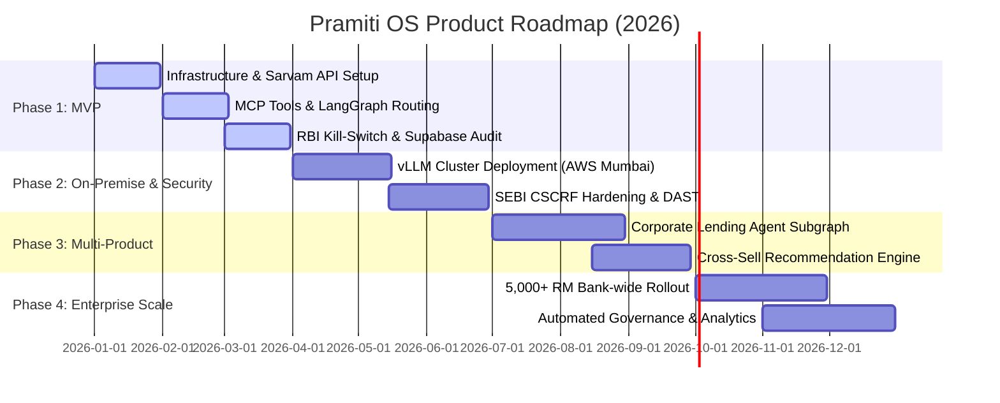

# Product Roadmap & Release Plan: Pramiti OS

**Document Owner**: Technical Product Manager  
**Release Horizon**: Q1 2026 – Q4 2026  
**Target Release**: Release v1.0-MVP (Phase 1)  

---

## 1. Execution Strategy: The Vertical Slice Approach

For Pramiti OS, we utilize a **Vertical Slice Approach** executed within a lightweight Agile framework. Traditional Waterfall is too rigid for AI platforms, and standard horizontal development (building the entire database, then all MCP tools, then the AI nodes) results in zero working end-to-end features until the end of the project.

### Why Vertical Slice Beats Horizontal Agile

**Horizontal Approach (High Risk)**:
*   **[Layer 1]** Build All Database Schemas
*   **[Layer 2]** Build All 6 MCP Tool Servers
*   **[Layer 3]** Build All LangGraph Agents
*   **[Layer 4]** Build Next.js UI Frontend
*(Nothing works end-to-end until Layer 4 is complete. If you discover a latency or prompt limit issue at Layer 4, the entire timeline slips).*

**Vertical Slice Approach (De-risked & Recommended)**:
*   **Slice 1 Definition**: "Fetch Portfolio Allocation & Trigger RBI Interrupt"
*   **Execution**: Build a single complete journey connecting the UI Panel → LangGraph Router → Agent → MCP Tool → Supabase DB → NodeInterrupt.
*(Proves the entire stack in 1 week. Immediate architectural validation).*

### Methodology Comparison Matrix

| Dimension | Waterfall | Horizontal Agile | Vertical Slice (Recommended) |
| :--- | :--- | :--- | :--- |
| **Execution Flow** | Sequential (PRD → Backend → Frontend) | Layer-by-Layer across sprints | End-to-End feature by feature |
| **Architecture Risk** | High (Discovered late at integration) | Medium (Discovered mid-way) | Low (Discovered on Day 3) |
| **Time-to-Working Demo** | Week 6–8 | Week 4–5 | Week 1 |
| **Adaptability to AI Limits** | Poor | Fair | Excellent |

---

## 2. Slice 1: Definition & Scope

To de-risk the project immediately, **Slice 1** focuses strictly on the single most critical user journey.

**Goal**: Prove that an RM can type a natural language request, trigger an MCP database lookup, maintain session context, and receive a structured UI output that pauses for human approval.

### What to Build in Slice 1 (End-to-End)
*   **Database**: Create 1 Supabase table (`portfolios`) seeded with mock data for 2 test clients.
*   **MCP Tool**: Build 1 local Python MCP server containing a single tool: `get_client_portfolio(client_id)`. Include basic PII masking.
*   **LangGraph Pipeline**: Build 2 simple nodes: Supervisor Node (classifies intent), Portfolio Node (calls MCP tool), and an Interrupt Edge (pauses execution if `requires_approval = True`).
*   **UI Frontend**: Build a minimal Next.js screen with a sticky right-hand Client Context Sidebar, central chat input, and a "Review Proposal" card triggered by the graph interrupt.

*(Excluded from Slice 1: Multiple specialist agents, Qdrant vector retrieval, multi-language support).*

---

## 3. Execution Roadmap (MVP Sprints)

*   **Sprint 1 (Vertical Slice 1)**: Build the full pipeline end-to-end for 1 feature. Validate UI-to-LangGraph state handling and the RBI interrupt loop.
*   **Sprint 2 (Vertical Slice 2 - Knowledge Layer)**: Add the Qdrant vector database and the Research/Compliance Agent to enable SEBI citation checking.
*   **Sprint 3 (Polishing & Testing)**: Add error handling, refine the UI typography/data tables, and record a video walkthrough for your portfolio.

---

## 4. 4-Quarter Executive Roadmap

---

## 5. Release Breakdown

### 🚀 Phase 1 MVP (Q1 2026) — *Core RM Augmentation (Current Target)*
* **Objective**: Deliver functional multi-agent advisory graph with RBI kill-switch for 50 pilot RMs.
* **Core Deliverables**:
  * Sarvam AI Cloud API integration (`Sarvam-30B` routing, `Sarvam-105B` reasoning).
  * LangGraph stateful graph with `PostgresSaver` checkpointer.
  * MCP servers for client portfolio retrieval and SIP return calculation.
  * RBI MRMF interrupt edge (`interrupt_before=["human_review"]`).
* **Exit Criteria**: 100% test scenario pass rate for multi-turn portfolio queries and kill-switch pauses.

---

### 🛡️ Phase 2: On-Premise Sovereign Deployment & Security (Q2 2026)
* **Objective**: Transition from Cloud API to 100% on-premise VPC hosting; enforce SEBI CSCRF compliance.
* **Core Deliverables**:
  * Multi-GPU vLLM deployment inside AWS Mumbai / Azure India VPC.
  * DEPA 2.0 PII Scrubbing Middleware.
  * Autonomous DAST & OWASP Top 10 API hardening under SEBI `cyber-suraksha.ai` circular.
* **Exit Criteria**: Independent third-party vulnerability audit clearance.

---

### 📈 Phase 3: Multi-Product Expansion (Q3 2026)
* **Objective**: Expand from Wealth Management into Corporate Lending and Structured Advisory.
* **Core Deliverables**:
  * Corporate Credit Underwriting Agent.
  * Real-time Multi-Product Cross-Sell Recommendation Engine.
  * Qdrant RAG index extension for SEBI & RBI regulatory guidelines.

---

### 🌐 Phase 4: Enterprise Scale & Governance (Q4 2026)
* **Objective**: Scale to 5,000+ RMs across Tier-1 Banking Partner network.
* **Core Deliverables**:
  * Horizontal auto-scaling of MCP servers and Postgres checkpointers.
  * Executive Compliance Dashboard & Automated 10-Year Audit Reporting.

---

## 6. RICE Prioritization Matrix (Feature Selection)

To ensure objective roadmap sequencing, features were scored using the **RICE PM Framework** (Reach x Impact x Confidence / Effort).

| Feature / Epic | Reach | Impact (3) | Confidence (100%) | Effort (Months) | RICE Score | Release |
| :--- | :--- | :--- | :--- | :--- | :--- | :--- |
| **LangGraph + MCP Routing** | 100% | 3 (Massive) | 90% | 1.5 | **180** | Phase 1 (MVP) |
| **RBI MRMF Kill-Switch** | 100% | 3 (Massive) | 95% | 1.0 | **285** | Phase 1 (MVP) |
| **On-Premise vLLM VPC** | 100% | 2 (High) | 80% | 2.5 | **64** | Phase 2 |
| **Corporate Lending Agent** | 30% | 3 (Massive) | 70% | 3.0 | **21** | Phase 3 |

---

## 7. Phase 1 Bank Pilot Onboarding Plan (50-RM Cohort)

| Week | Milestone | Key Activities | Owner |
| :--- | :--- | :--- | :--- |
| **Week 1-2** | Environment Prep | Deploy Supabase mock tables; issue Sarvam API keys to staging graph. | DevOps |
| **Week 3-4** | RM Training | Conduct interactive onboarding workshops with 50 selected Wealth RMs. | Product / Enablement |
| **Week 5-8** | Live Pilot Run | RMs utilize Pramiti OS for live HNI client consultations under human review mode. | Product / RM Team |
| **Week 9** | Pilot Review | Evaluate NPS, AUM mobilization speed, and human override logs. | Executive Sponsor |
