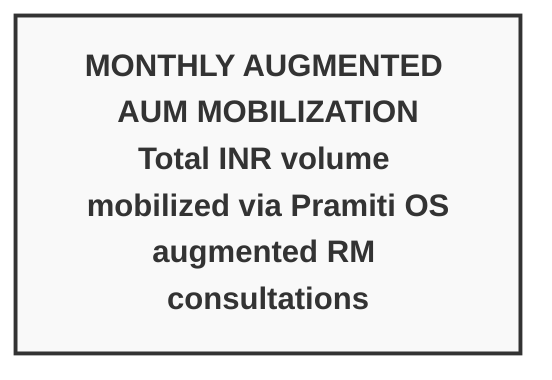
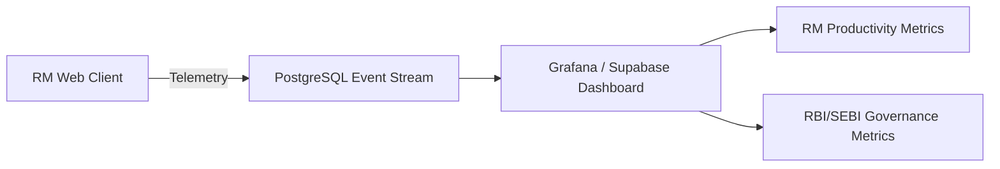

# Analytics & Success Metrics Framework: Pramiti OS

**Document Owner**: Product Analytics & Engineering Lead  
**Scope**: Product Performance, RM Productivity, Algorithmic Safety & Compliance  

---

## 1. North Star Metric

---

## 2. HEART Metrics Framework (Google PM Standard)

To rigorously track product success, we apply the **HEART Framework** (Happiness, Engagement, Adoption, Retention, Task Success) tailored for B2B enterprise software.

| HEART Dimension | Goal | Core Metric / KPI | Target | Tracking Mechanism |
| :--- | :--- | :--- | :--- | :--- |
| **Happiness** | RMs feel augmented, not replaced. | RM Net Promoter Score (NPS) | **> 65** | Quarterly In-App Survey |
| **Engagement** | High daily usage of the OS. | Daily Outbound Call Capacity | **40–50 calls / day** (Up from 15) | CRM Interaction Logs |
| **Adoption** | Smooth rollout across RM cohorts. | % of HNI consultations using OS | **> 85%** | Supabase Session Logs |
| **Retention** | RMs don't revert to manual toggling. | Weekly Active Users (WAU) / Total | **> 90%** | Web Client Auth Logs |
| **Task Success** | Frictionless advisory execution. | Data Retrieval Latency | **< 2.0 seconds** (Down from 8 mins) | Sarvam API Telemetry |
| **Task Success** | Administrative efficiency. | Post-Call Logging Latency | **< 60 seconds** (Down from 25 mins) | Checkpoint Timestamps |

---

### Category 2: Algorithmic Safety & Regulatory Governance

| Metric | Compliance Target | Risk Threshold | Tracking Mechanism |
| :--- | :--- | :--- | :--- |
| **Human Kill-Switch Pauses** | 100% of high-risk actions | < 100% is a critical violation | LangGraph Checkpoint State Logs |
| **Human Override / Rejection Rate** | 5% – 12% (Healthy) | > 30% indicates model drift | `rbi_mrmf_audit_logs` |
| **DPDP PII Masking Failure Rate** | **0.00%** | > 0.00% triggers automated kill-switch | MCP Middleware Log Filter |
| **Audit Trail Completeness** | 100% (10-Year retention) | < 100% triggers compliance alert | Postgres Integrity Auditor |

---

### Category 3: System Reliability & Performance

* **p95 Graph Execution Latency**: < 2.5 seconds (from RM prompt to proposal recommendation).
* **p99 Checkpointer Latency**: < 150 ms (PostgresSaver checkpoint write).
* **MCP Middleware Availability**: 99.95% uptime across all external database tool connectors.

---

## 3. Analytics Dashboard Architecture

